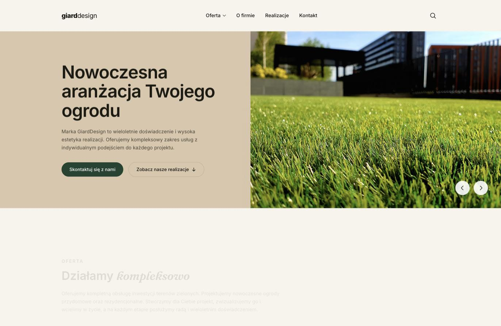
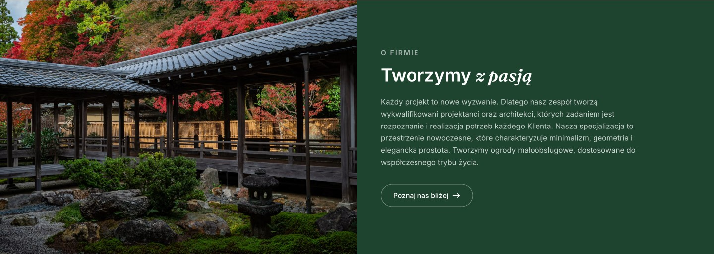
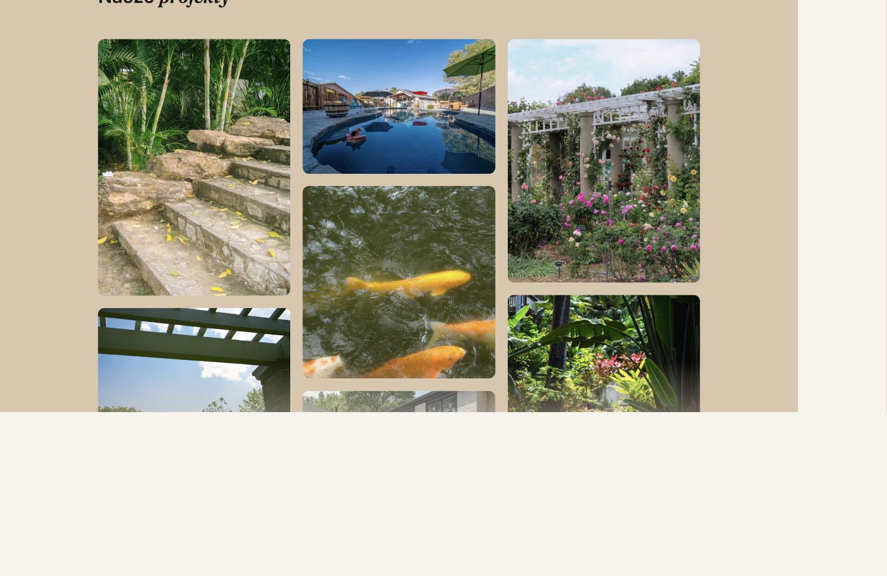
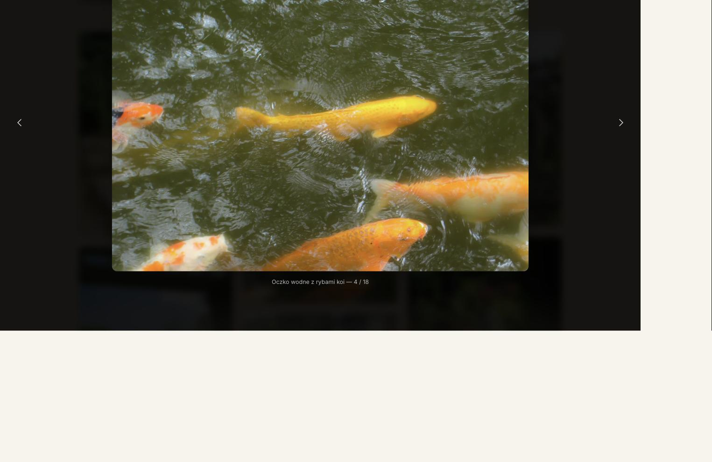
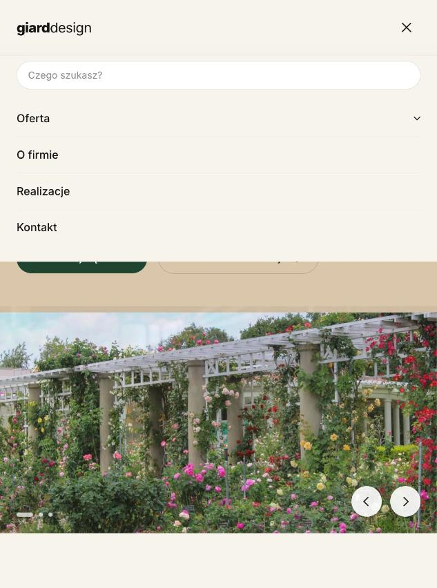

<div align="center">

# giarddesign

**Nowoczesny, responsywny landing page dla pracowni projektowania ogrodów**

Rekonstrukcja projektu graficznego (Figma) wykonana jako zadanie rekrutacyjne dla [adRespect.pl](https://adrespect.pl).

**🌐 Demo na żywo: [piotrromanczuk.github.io/giarddesign](https://piotrromanczuk.github.io/giarddesign/)**

[](https://github.com/PiotrRomanczuk/giarddesign/actions/workflows/deploy.yml)
[](https://github.com/PiotrRomanczuk/giarddesign/actions/workflows/ci.yml)


</div>

<p align="center">
  
  
</p>
<p align="center">
  
  
</p>

---

## Spis treści

- [O projekcie](#o-projekcie)
- [Demo i zrzuty ekranu](#demo-i-zrzuty-ekranu)
- [Stack technologiczny](#stack-technologiczny)
- [Zaimplementowane funkcje](#zaimplementowane-funkcje)
- [Szybki start](#szybki-start)
- [Skrypty npm](#skrypty-npm)
- [Struktura projektu](#struktura-projektu)
- [Architektura](#architektura)
- [System projektowy (design tokens)](#system-projektowy-design-tokens)
- [Warstwa danych](#warstwa-danych)
- [Dostępność](#dostępność)
- [Wydajność i build](#wydajność-i-build)
- [Wdrożenie](#wdrożenie)
- [Dalsza dokumentacja](#dalsza-dokumentacja)
- [Prawa autorskie i licencja](#prawa-autorskie-i-licencja)
- [Autor](#autor)

---

## O projekcie

`giarddesign` to jednostronicowa witryna (SPA-landing) fikcyjnej pracowni projektowania i realizacji
ogrodów. Projekt powstał jako **zadanie rekrutacyjne** — celem była wierna rekonstrukcja w kodzie
makiety graficznej dostarczonej w Figmie, z zachowaniem mikro-interakcji, responsywności i estetyki
oryginału.

Nacisk położono na:

- **wierność projektowi** — siatka, typografia, kolory i odstępy odwzorowują makietę,
- **jakość mikro-interakcji** — slider hero, dropdowny, galeria masonry z lightboxem, animacje scroll-reveal,
- **czysty, typowany kod** — komponenty Vue 3 `<script setup>` + TypeScript, dane odseparowane od widoków,
- **zero martwego stanu** — pełny typecheck (`vue-tsc`) przechodzi bez błędów, build produkcyjny działa.

## Demo i zrzuty ekranu

**Wersja live:** <https://piotrromanczuk.github.io/giarddesign/> (wdrażana automatycznie z brancha
`master` przez GitHub Actions → GitHub Pages).

Możesz też uruchomić lokalnie (`npm install && npm run dev`) albo obejrzeć zrzuty ekranu w
[`docs/screenshots/`](docs/screenshots).

| Widok | Podgląd |
| --- | --- |
| Hero (slider) | [`01-hero.jpg`](docs/screenshots/01-hero.jpg) |
| O firmie | [`02-about.jpg`](docs/screenshots/02-about.jpg) |
| Galeria (masonry) | [`03-gallery-masonry.jpg`](docs/screenshots/03-gallery-masonry.jpg) |
| Lightbox | [`04-lightbox.jpg`](docs/screenshots/04-lightbox.jpg) |
| Mobile (menu) | [`05-mobile.jpg`](docs/screenshots/05-mobile.jpg) |

<p align="center">
  
</p>

## Stack technologiczny

| Warstwa | Technologia | Uwagi |
| --- | --- | --- |
| Framework | **Vue 3.5** (`<script setup>`, Composition API) | komponenty jednoplikowe (SFC) |
| Język | **TypeScript 6** | tryb ścisły, `vue-tsc` w buildzie |
| Bundler / dev server | **Vite 8** | HMR, build produkcyjny |
| Style | **Tailwind CSS v4** | konfiguracja CSS-first (`@theme` w `style.css`), PostCSS + Autoprefixer |
| Galeria | **masonry-layout 4** + **imagesloaded 5** | responsywny układ kafelków, przeliczanie po doładowaniu obrazów |
| Fonty | **Inter** + **Fraunces** | Google Fonts (`display=swap`) |
| Zdjęcia | **Unsplash** (dynamiczne URL-e) | parametryzowane rozmiary/jakość, `loading="lazy"` |

Projekt **nie ma backendu ani bazy danych** — to statyczna witryna front-endowa. Cała treść pochodzi
z typowanych plików w [`src/data/`](src/data).

## Zaimplementowane funkcje

Wszystkie zachowania odwzorowują notatki z makiety projektowej:

- **Hero** — lewa kolumna (tekst) trzyma się siatki strony, prawa kolumna (zdjęcie) wychodzi poza siatkę
  aż do krawędzi ekranu. Cała sekcja to **slider**: crossfade obrazu, oddzielna animacja tekstu, autoplay
  (6,5 s) z pauzą na hover, strzałki prev/next oraz kropki nawigacyjne na mobile.
- **Nawigacja** — pozycja „Oferta" rozwija **dropdown** po kliknięciu (zamyka się klawiszem `Escape` oraz
  kliknięciem poza obszarem); ikona lupy rozwija **pole wyszukiwania** z auto-focusem; nagłówek zmienia tło
  na przyklejone/rozmyte po przewinięciu strony.
- **Menu mobilne** — hamburger otwiera panel z polem wyszukiwania i akordeonem „Oferta"; linki zamykają menu.
- **Oferta** — trzy w pełni klikalne karty z efektem hover (uniesienie + cień + zmiana koloru ikony);
  ikony rysowane inline jako SVG.
- **O firmie** — odwrócony układ hero: zdjęcie wychodzi poza siatkę po lewej, treść trzyma się siatki po prawej.
- **Realizacje** — galeria **masonry** z responsywną liczbą kolumn (1 / 2 / 3), przyciskiem „Rozwiń"
  odsłaniającym pełną galerię (spod gradientowej maski), oraz **lightboxem** z nawigacją prev/next,
  obsługą klawiszy `←` / `→` / `Escape`, blokadą przewijania tła i podpisem „X / N".
- **Animacje scroll-reveal** — sekcje pojawiają się (fade + slide-up) przy wejściu w viewport, sterowane
  jednym `IntersectionObserver` w composable `useInViewFade`.

## Szybki start

### Wymagania

- **Node.js ≥ 20.19** (zalecane 22 LTS — zgodne z wymaganiami Vite 8)
- **npm** (dostarczany z Node)

### Instalacja i uruchomienie

```bash
# 1. Sklonuj repozytorium
git clone https://github.com/PiotrRomanczuk/giarddesign.git
cd giarddesign

# 2. Zainstaluj zależności
npm install

# 3. Uruchom serwer developerski (Vite, HMR)
npm run dev
# → http://localhost:5173
```

### Build produkcyjny

```bash
npm run build      # typecheck (vue-tsc) + build do katalogu dist/
npm run preview    # lokalny podgląd zbudowanej wersji (http://localhost:4173)
```

## Skrypty npm

| Skrypt | Polecenie | Opis |
| --- | --- | --- |
| `npm run dev` | `vite` | serwer developerski z Hot Module Replacement |
| `npm run build` | `vue-tsc -b && vite build` | pełny typecheck, a następnie build produkcyjny do `dist/` |
| `npm run preview` | `vite preview` | serwuje zbudowaną wersję z `dist/` do weryfikacji |

> **Uwaga:** `npm run build` najpierw uruchamia `vue-tsc`, więc każdy błąd typów zatrzymuje build —
> to celowa bramka jakości.

## Struktura projektu

```
giarddesign/
├── index.html                  # punkt wejścia HTML, preconnect + fonty Google
├── vite.config.ts              # konfiguracja Vite (plugin Vue)
├── postcss.config.js           # Tailwind v4 + Autoprefixer
├── tsconfig*.json              # konfiguracja TypeScript (app / node / references)
├── docs/                       # dokumentacja (ta dokumentacja + zrzuty ekranu)
│   ├── ARCHITECTURE.md
│   ├── DEPLOYMENT.md
│   └── screenshots/
└── src/
    ├── main.ts                 # bootstrap aplikacji Vue
    ├── style.css               # Tailwind + design tokens (@theme) + klasy komponentowe
    ├── App.vue                 # kompozycja sekcji strony
    ├── components/             # komponenty widoku (jeden plik = jedna sekcja/element)
    │   ├── AppHeader.vue        #   nagłówek: nawigacja, dropdown, search, menu mobilne
    │   ├── HeroSlider.vue       #   hero jako slider (autoplay, crossfade)
    │   ├── OfferSection.vue     #   karty oferty
    │   ├── AboutSection.vue     #   sekcja „O firmie"
    │   ├── ProjectsGallery.vue  #   galeria masonry + sterowanie lightboxem
    │   ├── Lightbox.vue         #   modal galerii (Teleport, klawiatura, blokada scrolla)
    │   ├── ContactBanner.vue    #   baner kontaktowy (Instagram)
    │   └── AppFooter.vue        #   stopka
    ├── composables/
    │   └── useInViewFade.ts    # scroll-reveal oparty o IntersectionObserver
    └── data/                   # typowane dane treści (odseparowane od widoków)
        ├── heroSlides.ts        #   slajdy hero
        ├── offers.ts            #   karty oferty
        ├── gallery.ts           #   zdjęcia galerii (+ helper wymiarów)
        └── unsplash.ts          #   builder URL-i Unsplash
```

## Architektura

- **Wzorzec:** pojedyncze `App.vue` komponuje niezależne sekcje; każdy komponent odpowiada za jedną część
  widoku (Single Responsibility). Stan jest **lokalny dla komponentów** — brak globalnego store'a, bo skala
  strony tego nie wymaga.
- **Dane oddzielone od prezentacji:** treść i konfiguracja (slajdy, karty, obrazy) mieszkają w `src/data/`
  jako typowane stałe. Komponenty tylko je renderują, więc zmiana treści nie wymaga dotykania JSX/szablonu.
- **Stylowanie:** Tailwind v4 w podejściu *CSS-first* — zmienne motywu i tokeny zdefiniowane w `@theme`
  wewnątrz `style.css`; powtarzalne wzorce (`.btn-solid`, `.wrap`, `.eyebrow`, `.reveal`) jako klasy
  komponentowe w `@layer components`.
- **Interakcje:** logika slidera, galerii i nagłówka to zwykłe funkcje w `<script setup>` z prawidłowym
  sprzątaniem nasłuchów w `onBeforeUnmount` (brak wycieków). Masonry i lightbox integrują biblioteki
  imperatywne z reaktywnym cyklem życia Vue.

Pełny opis (drzewo komponentów, przepływ zdarzeń galerii, niuanse inicjalizacji masonry) znajdziesz w
[`docs/ARCHITECTURE.md`](docs/ARCHITECTURE.md).

## System projektowy (design tokens)

Zdefiniowane w `src/style.css` (blok `@theme`):

| Token | Wartość | Zastosowanie |
| --- | --- | --- |
| `--color-cream` | `#f7f3ec` | tło strony |
| `--color-tan` / `--color-tan-dark` | `#dac6ac` / `#cbb495` | tło hero, sekcji realizacji |
| `--color-green-deep` | `#1e4430` | kolor marki (przyciski, „O firmie", akcenty) |
| `--color-green-mid` / `--color-green-bright` | `#26543a` / `#2f6b46` | stany hover / warianty |
| `--color-ink` | `#16150f` | tekst podstawowy, stopka |
| `--color-muted` | `#6b6558` | tekst pomocniczy |
| `--font-sans` | Inter | tekst UI |
| `--font-accent` | Fraunces (italic) | akcenty typograficzne (`.accent`) |

## Warstwa danych

Zdjęcia serwowane są bezpośrednio z **Unsplash** przez helper `unsplash(id, width, height?, quality?)`
([`src/data/unsplash.ts`](src/data/unsplash.ts)), który buduje URL-e z parametrami `auto=format`,
`fit=crop` oraz zadanym rozmiarem i jakością. Miniatury galerii mają zapisany współczynnik proporcji
(`ratio`), dzięki czemu masonry potrafi rozmieścić kafelki jeszcze przed pełnym załadowaniem obrazów,
a pełną rozdzielczość lightbox pobiera osobno (`full`).

> Zdjęcia to poglądowe materiały z Unsplash użyte wyłącznie do celów demonstracyjnych zadania rekrutacyjnego.

## Dostępność

- semantyczne znaczniki (`header` / `main` / `section` / `footer`, nagłówki w hierarchii),
- `aria-label` / `aria-expanded` / `aria-haspopup` na przyciskach interaktywnych (menu, slider, lightbox, search),
- pełna obsługa klawiatury w lightboxie (`←` / `→` / `Escape`) i zamykanie dropdownów `Escape`,
- `alt` na wszystkich zdjęciach, `loading="lazy"` w galerii,
- `scroll-behavior: smooth` z `scroll-padding-top` uwzględniającym przyklejony nagłówek.

## Wydajność i build

Wynik `npm run build` (Vite 8, gzip):

| Zasób | Rozmiar | Gzip |
| --- | --- | --- |
| `index.html` | ~1.3 kB | ~0.7 kB |
| CSS | ~36 kB | ~6.7 kB |
| JS | ~127 kB | ~46 kB |

Optymalizacje: `loading="lazy"` na obrazach galerii, `preconnect` do domen Google Fonts, `display=swap`,
przeliczanie masonry z `requestAnimationFrame` i debounce na `resize`.

## Wdrożenie

Statyczny build (`dist/`) można wdrożyć na dowolnym hostingu SPA (Vercel, Netlify, GitHub Pages, Cloudflare
Pages, S3). Skrócona instrukcja i uwaga o `base` przy hostowaniu w podkatalogu — zob.
[`docs/DEPLOYMENT.md`](docs/DEPLOYMENT.md).

## Dalsza dokumentacja

| Dokument | Zawartość |
| --- | --- |
| [`docs/ARCHITECTURE.md`](docs/ARCHITECTURE.md) | drzewo komponentów, przepływ danych, niuanse implementacyjne |
| [`docs/DEPLOYMENT.md`](docs/DEPLOYMENT.md) | build i warianty wdrożenia (Vercel / Netlify / GitHub Pages) |
| [`docs/screenshots/`](docs/screenshots) | zrzuty ekranu poszczególnych sekcji |

## Prawa autorskie i licencja

- **Kod źródłowy** jest wynikiem własnej pracy autora w ramach procesu rekrutacyjnego i służy celom
  demonstracyjnym (portfolio / ocena rekrutacyjna). Szczegóły: [`LICENSE`](LICENSE).
- **Projekt graficzny** (makieta, layout, identyfikacja wizualna) należy w całości do **adRespect.pl**.
- **Zdjęcia** pochodzą z **Unsplash** (poglądowo) i podlegają [licencji Unsplash](https://unsplash.com/license).

Repozytorium nie jest przeznaczone do komercyjnego wykorzystania projektu graficznego ani do redystrybucji
jako gotowy produkt.

## Autor

**Piotr Romańczuk** — [GitHub @PiotrRomanczuk](https://github.com/PiotrRomanczuk)
